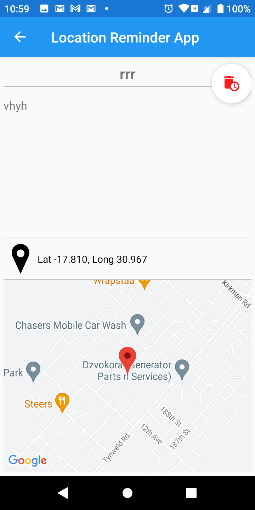

# Location Reminder App

Location Reminder is an Android Kotlin Developer nanodegree project, designed as a hands-on assignment for the Advanced Android Apps with Kotlin course, specifically concentrating on the second chapter. This project focuses on advanced concepts, particularly those related to location services and geofencing.

## Repository
You can clone the repository at [git@github.com:simbastart001/Location-Reminder-App.gi](https://github.com/simbastart001/Location-Reminder-App.git).

## Project Overview
The primary goal of Location Reminder is to create a seamless experience for users to associate reminders with specific locations on a map. When users enter the designated geographical area, a notification is triggered, serving as a reminder for the associated task.

## Course Context
This project builds upon the foundation laid in the earlier stages of the Android Kotlin Developer nanodegree. Concepts from the first chapter, showcased in projects like Shoe Store and Asteroid Radar, are leveraged. Additionally, knowledge gained from the previous project in the second chapter, Loading Status, is integrated into Location Reminder.

## Key Components
Location Reminder showcases the application of various components, including but not limited to:

1. **Maps Integration:**
   - Utilizes Google Maps to allow users to set specific locations for reminders.

2. **Broadcast Receivers:**
   - Implements Broadcast Receivers to handle user interactions with notifications, ensuring a seamless experience.

3. **Testing:**
   - Incorporates robust testing methodologies for both unit testing and UI testing, emphasizing the importance of app reliability.

## Screenshots
.png)
.png)
.png)
.png)
.png)
.png)

## New Feature

## App Structure
The app comprises three main screens for primary navigation, complemented by an additional screen activated when users interact with incoming notifications. Furthermore, a dedicated login process is seamlessly integrated, ensuring a secure and personalized experience for users.

## Technical Highlights
Location Reminder extends the scope of the course by introducing and applying the following advanced topics:

1. **Maps Integration:**
   - Enables users to associate reminders with specific locations on the map.

2. **Broadcast Receivers:**
   - Manages notification click events, providing users with a responsive and intuitive interface.

3. **Testing:**
   - Establishes a comprehensive testing suite, covering unit tests and UI tests to guarantee the reliability of the application.

## Screens
1. **Map View:**
   - Allows users to set specific locations for reminders.

2. **Reminders List:**
   - Displays a list of reminders associated with locations.

3. **Create Reminder:**
   - Enables users to add new reminders with titles, descriptions, and associated locations.

4. **Notification Detail:**
   - Opens when users click on a notification, displaying details about the associated reminder.

## Installation
To run the app locally, follow these steps:
1. Clone the repository: `git clone https://github.com/simbastart001/location-reminder.git`
2. Open the project in Android Studio.
3. Build and run the app on an Android emulator or device.

## License
This project is licensed under the MIT License - see the [LICENSE](LICENSE) file for details.

Feel free to explore, contribute, or provide feedback. Happy coding!
